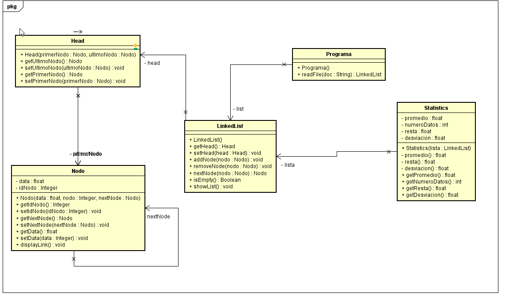

# INTRODUCTION TO COMPLEX SYSTEMS, JAVA, MVN, AND GIT
# 2019-2  Arquitectura empresarial Grupo: 1

# Integrante
## Juan Pablo Ospina Henao

# Descripción del producto.
### Descripción 
Este laboratorio tiene como fin, recordat el manejo de mvn y de git en un problema de estadistica que requeire la 
lectura de datos de un archivo y su almacenaje con Linked List realizada por el estudiante.

# Diseño
## Modelo E-R

